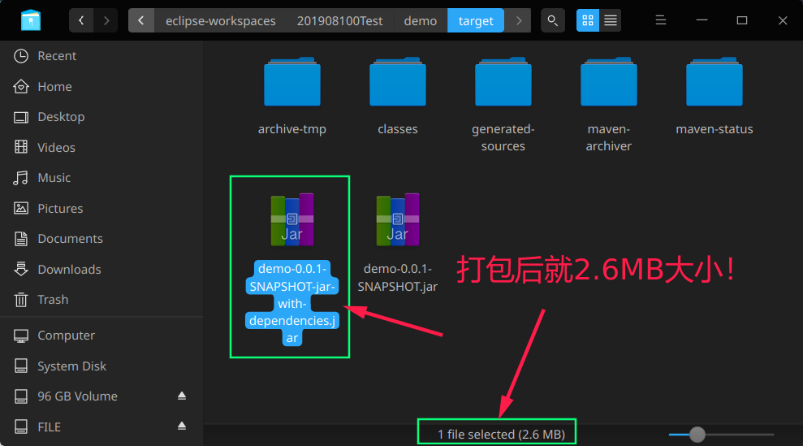
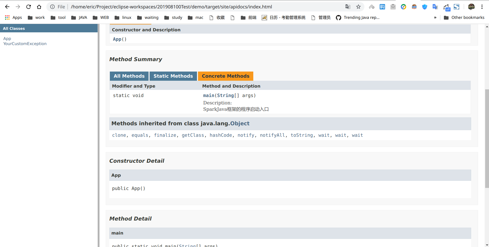

# SparkDemo
[](http://sparkjava.com)
* sparkJava只有slf4j，自己添加了log4j2
* 集成了spring-context，可以控制反转注入等。Bean同一管理，使代码更加简洁。
* Route类只对应一个url貌似很麻烦！
## 技术栈搭建
对于一个小型的应用，快速搭建可以使用

应用层次 | 框架名 | 推荐理由
--- | --- | ---
前端交互|Sparkjava| 更加简单的url-方法
服务层| Spring-context|控制翻转，Bean注入
ORM层| rexdb|高效灵活简单
数据库|postgresql|开源自由


## 体验感
作为一款java的Web框架，确实觉得Spark要比SpringMVC更加的简洁，而且大量使用lambda表达式，使程序写的更加简洁紧凑。由于没有深入了解，作为一个独立的web应用而言，Spark显然要比SpringMVC更加的轻量化，更加简洁，也就是说Spark更加适合比较小型简单的应用开发。但是Spring的生态要比Spark更加丰富，作为企业级开发自然首选Spring全家桶。
## SparkJava
#### 官网：http://sparkjava.com
#### github：https://github.com/perwendel/spark
#### debug tool：https://github.com/perwendel/spark-debug-tools
* 支持Java与Kotlin
* jar比较小，大约10M
* 占内存小，大约30~60MB；
* 性能还可以，与Spring Boot相仿；
## 打包成能运行的jar
```xml
<build>
        <plugins>
        	<plugin>
				<artifactId>maven-assembly-plugin</artifactId>
				<configuration>
					<archive>
						<manifest>
							<addClasspath>true</addClasspath>

							<!--下面必须指定好主类 如com.my.Main -->
							<mainClass>hxy.sparkjava.demo.App</mainClass>
						</manifest>
					</archive>
					<descriptorRefs>
						<descriptorRef>jar-with-dependencies</descriptorRef>
					</descriptorRefs>
				</configuration>
				<executions>
					<execution>
						<id>make-my-jar-with-dependencies</id>
						<phase>package</phase>
						<goals>
							<goal>single</goal>
						</goals>
					</execution>
				</executions>
			</plugin>
            <plugin>
                <artifactId>maven-compiler-plugin</artifactId>
                <configuration>
                    <source>1.8</source>
                    <target>1.8</target>
                    <encoding>UTF-8</encoding>
                </configuration>
            </plugin>
        </plugins>
    </build>
```
#### 打包
```shell
mvn clean package -Dmaven.test.skip=true && cd target/
```

#### 打包后的结果:

#### 运行程序
```
java -jar demo-0.0.1-SNAPSHOT-jar-with-dependencies.jar
```
#### 生成doc文档
```shell
mvn javadoc:javadoc
```



### log
2019/11/06 : 加入spring-context，可以控制反转与Bean注入，代码更加简洁。